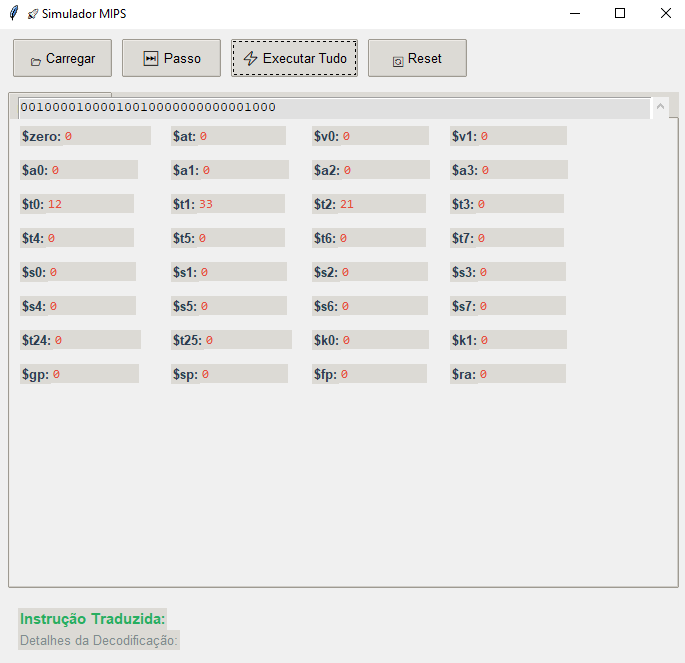

# MIPS Simulator

Este é um simulador de um processador MIPS, desenvolvido em Python com uma interface gráfica utilizando Tkinter.

## Funcionalidades

- Suporte a instruções básicas da arquitetura MIPS
- Interface gráfica para visualização dos registradores e memória
- Simulação de execução passo a passo das instruções

## Imagens

1. **img_mips1.png**  
   A interface inicial, mostrando a tradução para assembly e seus respectivos registradores. Também oferece opções para carregar um arquivo, executar o passo a passo ou executar diretamente.

   

2. **img_mips2.png**  
   A visualização do processo de leitura do código binário, destacando os registradores em cada etapa.

   

3. **img_mips3.png**  
   A tradução completa do código binário para o formato assembly.

   

## Instruções para rodar o MIPS Simulator

### Requisitos:
- Python instalado no PC
- Extensão do Python no VSCode com Tkinter (já vem com a extensão)

### Passos:
1. Abrir o código no VSCode
2. Ativar Tkinter (se não tiver ativado)  
   - **Windows:** python app.py  
   - **Linux:** python3 app.py
3. No terminal do VSCode, rodar:  
   
   ```bash
   python mips_simulator.py

